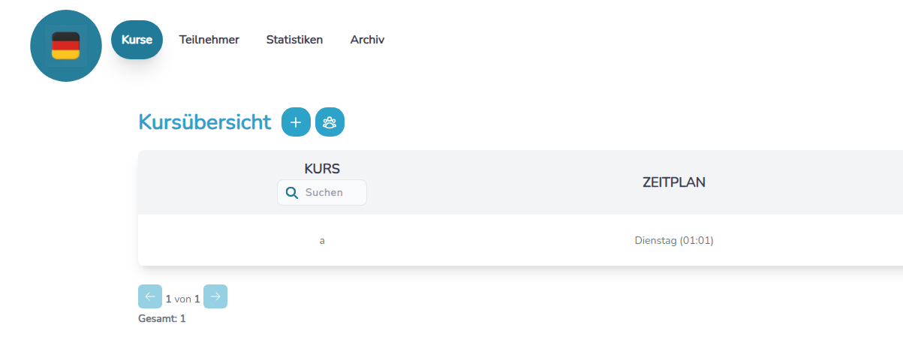

# Fit&Roll
**Fit&Roll** is a cross-platform desktop application for **managing courses** and tracking **participant engagement**. It allows you to:

- **Create, update, and archive courses**
- **Manage participant records**
- Track **attendance** and **participation** history
- View **statistics** and export data for advanced analysis

Fit&Roll simplifies the process of course management, making it more efficient and user-friendly.

## Table of Contents
### 🧑‍🏫 Common
- [⚙️ Starting the application](#️-starting-the-application)
- [👨‍💻 For developers](#-for-developers)
- [📑 License](#-license)
### 🚀 Release 1.X
- [🌍 Changing locale](#-changing-locale)
- [🔍 Scaling the Application](#-scaling-the-application)
- [📚 Managing Courses: Create, Update & Archive](#-managing-courses-create-update--archive)
- [🗂️ Managing Participants: Create, Update & Archive](#️-managing-participants-create-update--archive)
- [🏅 Member card overview](#-member-card-overview)
- [🧾 Attending courses](#-attending-courses)
- [📈 Course Participation History](#-course-participation-history)
- [📊 Statistics](#-statistics)
- [🗃️ Archive](#️-archive)
- [📤 Export](#-export)
### 🛸 Release 2.X
- [🧾 Extended Participant Data Model](#-extended-participant-data-model)
- [📥 Participant Import](#-participant-import)
- [🧹 Purging Participants](#-purging-participants)

## ⚙️ Starting the Application

- The compiled executables are located in the `release` directory.
- On **Linux**, download the `binary` file to run the application.
- On **Windows**, download the `.exe` file to run the application.
- Create a new folder on your machine and transfer the application file into this folder.
- When the application is started for the first time, a new file with the `.db` extension will be generated inside the folder.
- The `.db` file is a local database that stores all the application's data.
- **⚠️ Caution**: Deleting or renaming the `.db` file will erase all the application data.
- You are encouraged to make copies of the `.db` file for backup purposes.

# 🚀 Release 1.X
## 🌍 Changing Locale

- The application supports two languages: **German** (default) and **English**.
- To access the language selector, simply click on the **logo** in the top bar.
- To change the language, click on the **language selector** and choose your preferred language.

<div>
  
  <p><strong>Figure 1:</strong> German Language Selected</p>
</div>
<div>
  
  <p><strong>Figure 2:</strong> English Language Selected</p>
</div>

## 🔍 Scaling the Application

- You can easily adjust the zoom level of the application to your preference.
- To **zoom in**, press `Ctrl` + `+`.
- To **zoom out**, press `Ctrl` + `-`.
- The scaling setting is **persistent** — your preferred zoom level is saved and will be automatically applied the next time you open the application.

## 📚 Managing Courses: Create, Update & Archive

- To track the activity, you first need to **create a course**.
- Click the **➕ plus icon** to add a new course.
- Enter the **course name** and its **schedule**. A **description** is optional.
- You can **edit course details** (name, schedule, description) at any time.
- If a course is no longer active, you can **archive** it.
- All currently active courses are listed in the **Course Overview** table.

<div>
  
  <p><strong>Figure 1:</strong> Course Overview</p>
</div>
<div>
  
  <p><strong>Figure 2:</strong> Create a Course</p>
</div>
<div>
  
  <p><strong>Figure 3:</strong> Update a Course</p>
</div>
<div>
  
  <p><strong>Figure 4:</strong> Archive a Course</p>
</div>

## 🗂️ Managing Participants: Create, Update & Archive

- To track participation, you need to **add participants** to the application.
- Use the **Participants Overview** section to create a new participant.
- Each participant must have a **full name** and be assigned to a **group**.
- Participant details can be **updated at any time**.
- If a participant no longer attends any trainings, you can **archive** them.
- All active participants are displayed in the **Participants Overview** table.

<div>
  
  <p><strong>Figure 1:</strong> Participants Overview</p>
</div>
<div>
  
  <p><strong>Figure 2:</strong> Create a Participant</p>
</div>
<div>
  
  <p><strong>Figure 3:</strong> Update a Participant</p>
</div>

## 🏅 Member Card Overview

- To participate in courses, a participant shall first purchase a **member card**.
- A participant can own **several member cards**.
- If a member card was issued by mistake and the cardholder hasn't attended any courses, the card can be **returned**.
- Clicking on a member card will display the **history of attended courses**.

<div>
  
  <p><strong>Figure 1:</strong> Unused member card</p>
</div>
<div>
  
  <p><strong>Figure 2:</strong> Card history</p>
</div>

## 🧾 Attending Courses

- Participants can attend a course in **three ways**:  
  1. Using a **member card**  
  2. Taking a **trial attendance**  
  3. Attending **without a member card**
  
- If a participant was marked as attending by mistake, you can remove the entry via the **Overall Participant History** component.

- ⚠️ **Important:**  
  Removing an attendance that used a **member card** will **restore one available slot** on that card.

<div>
  
  <p><strong>Figure 1:</strong> Attending a course with a member card</p>
</div>
<div>
  
  <p><strong>Figure 2:</strong> No valid member card</p>
</div>
<div>
  
  <p><strong>Figure 3:</strong> Several valid member cards</p>
</div>
<div>
  
  <p><strong>Figure 4:</strong> Trial session</p>
</div>
<div>
  
  <p><strong>Figure 5:</strong> Attending without a member card</p>
</div>

## 📈 Course Participation History

- Participation can be tracked in **two ways**:
  1. **Per course** — View attendance history for a specific course.
  2. **Overall history** — Use the **Participation History** component to see attendance across all courses.

- 🧹 You can also **remove attendance entries** directly from the **Overall Participation History** view if needed.

- Each participation history view offers **advanced filtering options** to help you quickly find relevant data.

<div>
  
  <p><strong>Figure 1:</strong> Course Participation History</p>
</div>
<div>
  
  <p><strong>Figure 2:</strong> Overall Participation History</p>
</div>
<div>
  
  <p><strong>Figure 3:</strong> Delete participation entry</p>
</div>

## 📊 Statistics

- For each participant, you can view:
  - **How many courses** they have attended.
  - **How they attended**: using a member card, as a trial, or without a card.

- For each course, you can see:
  - **How often** it was attended.
  - **The attendance method** used by participants.

- All statistics components include a **date range filter** to help you narrow down and focus your analysis.
- All statistics components also include archived entries.

<div>
  
  <p><strong>Figure 1:</strong> Participant Statistics</p>
</div>
<div>
  
  <p><strong>Figure 2:</strong> Course Statistics</p>
</div>

## 🗃️ Archive

- View all **archived participants** and **restore** them when needed.
- View all **archived courses** and bring them back into the active view.
- Both archive components include **filtering options** to help you quickly find specific archived entries.

<div>
  
  <p><strong>Figure 1:</strong> Archive Overview</p>
</div>
<div>
  
  <p><strong>Figure 2:</strong> Archived Participants</p>
</div>
<div>
  
  <p><strong>Figure 3:</strong> Archived Courses</p>
</div>

## 📤 Export

- For advanced analysis, you can **export all current database data** to an **Excel file**.

<div>
  
  <p><strong>Figure 1:</strong> Export</p>
</div>

# 🛸 Release 2.X
## 🧾 Extended Participant Data Model

The **Participant** model has been extended to include more comprehensive personal and training-related information. The following fields have been added:
- **Phone number**  
- **Email address**  
- **Date of birth**  
- **Start of training date**  
- **Privacy policy accepted** *(yes/no)*  
- **Privacy policy accepted date**  
- **Address**  
- **Parent or guardian information** *(for underage participants)*  
- **Additional notes**

> **Note:** When exporting participant data, these new fields are included to provide a more comprehensive dataset.
<div>
  
  <p><strong>Figure 1:</strong> Extended Participant Form</p>
</div>

## 📥 Participant Import

You can now import participants directly from an Excel file.

### 📄 File Format Requirements

The Excel file **must contain exactly 12 columns** in the following order, each following specific rules:

1. **Name** – *Required*  
2. **Surname** – *Required*  
3. **Group** – *Required*  
4. **Phone** – *Optional* — No strict format  
5. **Email** – *Optional* — No strict format  
6. **Date of Birth** – *Optional* — Must be in `YYYY-MM-DD` format  
7. **Start of Training Date** – *Optional* — If missing, the current date is used. If provided, must be in `YYYY-MM-DD` format  
8. **Privacy Policy** – *Optional* — Defaults to `false`. Accepted values: `1` (accepted), `0` (not accepted)  
9. **Privacy Policy Accepted Date** – *Required if privacy policy is accepted* — Must be in `YYYY-MM-DD` format  
10. **Address** – *Optional* — No strict format  
11. **Parents** – *Optional* — No strict format  
12. **Notes** – *Optional* — For any additional information; no strict format

⚠️ **Important:** The combination of **Name** and **Surname** acts as a unique identifier for participants.

> If either attribute changes, the system will treat it as a new participant and add a new entry.

> If the **Name** and **Surname** remain the same but other attributes change, the existing participant’s record will be updated accordingly.

📥 [Download Sample Excel File with Participant Data](documentation/import_participants_sample.xlsx)

<div>
  
  <p><strong>Figure 1:</strong> Import Participants Button</p>
</div>

## 🧹 Purging Participants

You can now **permanently remove** a participant from the application. 

This feature might be useful in the following cases:

- A participant was created by mistake.
- A participant requests deletion of all their data from the application.

⚠️ **Warning:** This action **cannot be undone!**  
Deleting a participant will also remove **all associated member cards** and **participation history** permanently.

Purging a participant is accessible via the **Archived Participants** component.

<div>
  
  <p><strong>Figure 1:</strong> Purge Participant Button</p>
</div>

## 👨‍💻 For developers

### 🚀 Local Development

To run the application in live development mode, execute:
```bash
wails dev
```

This project uses Tailwind CSS for styling. To enable automatic generation of classes during development, run from the project directory:
```bash
npx @tailwindcss/cli -i ./frontend/src/assets/tailwind/style.css -o ./frontend/src/tailwind.css --watch
```
This command watches for changes and updates the compiled CSS in real time.
### 🛠️ Building the app
To build a redistributable, production mode package, use
```bash
wails build
```
For more details and advanced options, visit the official Wails documentation.

### 🧾 Logs

If any errors occur during runtime, a file named `logs.log` is automatically generated.  
This log file contains detailed information about the error, helping you to quickly identify issues.

You can find the `logs.log` file in the application's root directory.

## 📑 License

This project is licensed under the Apache License 2.0 - see the [LICENSE](./LICENSE) file for details.
